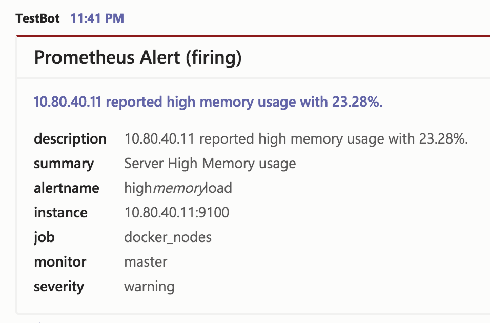
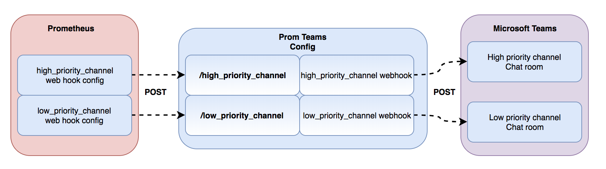

[](https://github.com/prometheus-msteams/prometheus-msteams/releases/)
[](https://travis-ci.org/prometheus-msteams/prometheus-msteams)
[](https://codecov.io/gh/prometheus-msteams/prometheus-msteams)
[](https://goreportcard.com/report/github.com/prometheus-msteams/prometheus-msteams)



# Overview

A lightweight Go Web Server that receives __POST__ alert messages from __Prometheus Alert Manager__ and sends it to a __Microsoft Teams Channel__ using an incoming webhook url. How light? See the [docker image](https://quay.io/repository/prometheusmsteams/prometheus-msteams?tab=tags)!

## Synopsis

Alertmanager doesn't support sending to Microsoft Teams out of the box. Fortunately, they allow you to use a generic [webhook_config](https://prometheus.io/docs/alerting/configuration/#webhook_config) for cases like this. This project was inspired from [idealista's](https://github.com/idealista/) [prom2teams](https://github.com/idealista/prom2teams) which was written in Python.

## Why choose Go? Not Python or Ruby or Node?

Why use [Go](https://golang.org/)? A Go binary is statically compiled unlike the other simple language (python, ruby, node). Having a static binary means that there is no need for you to install your program's dependencies and these dependencies takes up a lot of space in your docker image! Try it out DevOps folks!

## Table of Contents


<!-- vim-markdown-toc GFM -->

* [Getting Started (Quickstart)](#getting-started-quickstart)
  * [Installation](#installation)
  * [Setting up Prometheus Alert Manager](#setting-up-prometheus-alert-manager)
  * [Simulating a Prometheus Alerts to Teams Channel](#simulating-a-prometheus-alerts-to-teams-channel)
* [Sending Alerts to Multiple Teams Channel](#sending-alerts-to-multiple-teams-channel)
  * [Creating the Configuration File](#creating-the-configuration-file)
  * [Setting up Prometheus Alert Manager](#setting-up-prometheus-alert-manager-1)
* [Customise Messages to MS Teams](#customise-messages-to-ms-teams)
  * [Customise Messages per MS Teams Channel](#customise-messages-per-ms-teams-channel)
* [Configuration](#configuration)
* [Kubernetes Deployment](#kubernetes-deployment)
* [Contributing](#contributing)

<!-- vim-markdown-toc -->

## Getting Started (Quickstart)

How it works.


### Installation

We always recommend to use the latest stable release!

__OPTION 1:__ Run using docker.

```bash
docker run -d -p 2000:2000 \
    --name="promteams" \
    -e TEAMS_INCOMING_WEBHOOK_URL="https://outlook.office.com/webhook/xxx" \
    -e TEAMS_REQUEST_URI=alertmanager \
    quay.io/prometheusmsteams/prometheus-msteams
```

__OPTION 2:__ Run using binary.

Download the binary for your platform and the default card template from [RELEASES](https://github.com/prometheus-msteams/prometheus-msteams/releases), then run the binary in the same directory as you have stored the `default-message-card.tmpl`  like the following:

```bash
./prometheus-msteams -teams-request-uri alertmanager \
  -teams-incoming-webhook-url "https://outlook.office.com/webhook/xxx"
```

__OPTION 3:__ If you are going to deploy this in a **Kubernetes cluster**, checkout the [Kubernetes Deployment Guide](#kubernetes-deployment).

### Setting up Prometheus Alert Manager

By default, __prometheus-msteams__ creates a request uri handler __/alertmanager__.

```yaml
route:
  group_by: ['alertname']
  group_interval: 30s
  repeat_interval: 30s
  group_wait: 30s
  receiver: 'prometheus-msteams'

receivers:
- name: 'prometheus-msteams'
  webhook_configs: # https://prometheus.io/docs/alerting/configuration/#webhook_config 
  - send_resolved: true
    url: 'http://localhost:2000/alertmanager' # the prometheus-msteams proxy
```

> If you don't have Prometheus running yet and you wan't to try how this works,  
> try [stefanprodan's](https://github.com/stefanprodan) [Prometheus in Docker](https://github.com/stefanprodan/dockprom) to help you install a local Prometheus setup quickly in a single machine.

### Simulating a Prometheus Alerts to Teams Channel

Create the following json data as `prom-alert.json`.

```json
{
    "version": "4",
    "groupKey": "{}:{alertname=\"high_memory_load\"}",
    "status": "firing",
    "receiver": "teams_proxy",
    "groupLabels": {
        "alertname": "high_memory_load"
    },
    "commonLabels": {
        "alertname": "high_memory_load",
        "monitor": "master",
        "severity": "warning"
    },
    "commonAnnotations": {
        "summary": "Server High Memory usage"
    },
    "externalURL": "http://docker.for.mac.host.internal:9093",
    "alerts": [
        {
            "labels": {
                "alertname": "high_memory_load",
                "instance": "10.80.40.11:9100",
                "job": "docker_nodes",
                "monitor": "master",
                "severity": "warning"
            },
            "annotations": {
                "description": "10.80.40.11 reported high memory usage with 23.28%.",
                "summary": "Server High Memory usage"
            },
            "startsAt": "2018-03-07T06:33:21.873077559-05:00",
            "endsAt": "0001-01-01T00:00:00Z"
        }
    ]
}
```

```bash
curl -X POST -d @prom-alert.json http://localhost:2000/alertmanager
```

The teams channel should received a message.

## Sending Alerts to Multiple Teams Channel

You can configure this application to serve 2 or more request path and each path can use a unique Teams channel webhook url to post.



This can be achieved by supplying the application a configuration file.

### Creating the Configuration File

Create a yaml file with the following format.

```yaml
connectors:
- high_priority_channel: "https://outlook.office.com/webhook/xxxx/aaa/bbb"
- low_priority_channel: "https://outlook.office.com/webhook/xxxx/aaa/ccc"
```

> __NOTE__: high_priority_channel and low_priority_channel are example handler or request path names.

When running as a docker container, mount the config file in the container and set the __CONFIG_FILE__ environment variable.

```bash
docker run -d -p 2000:2000 \
    --name="promteams" \
    -v /tmp/config.yml:/tmp/config.yml \
    -e CONFIG_FILE="/tmp/config.yml" \
    quay.io/prometheusmsteams/prometheus-msteams:v1.3.5
```

When running as a binary, use the __-config-file__ flag.

```bash
./prometheus-msteams server \
    -l localhost \
    -p 2000 \
    -config-file /tmp/config.yml
```

This will create the request uri handlers __/high_priority_channel__ and __/low_priority_channel__.

To validate your configuration, see the __/config__ endpoint of the application.

```bash
curl localhost:2000/config

[
  {
    "high_priority_channel": "https://outlook.office.com/webhook/xxxx/aaa/bbb"
  },
  {
    "low_priority_channel": "https://outlook.office.com/webhook/xxxx/aaa/ccc"
  }
]
```

### Setting up Prometheus Alert Manager

Considering the __prometheus-msteams config file__ settings, your Alert Manager would have a configuration like the following.

```yaml
route:
  group_by: ['alertname']
  group_interval: 30s
  repeat_interval: 30s
  group_wait: 30s
  receiver: 'low_priority_receiver'  # default/fallback request handler
  routes:
    - receiver: high_priority_receiver
      match:
        severity: critical
    - receiver: low_priority_receiver
      match:
        severity: warning

receivers:
- name: 'high_priority_receiver'
  webhook_configs:
    - send_resolved: true
      url: 'http://localhost:2000/high_priority_channel' # request handler 1
- name: 'low_priority_receiver'
  webhook_configs:
    - send_resolved: true
      url: 'http://localhost:2000/low_priority_channel' # request handler 2
```

## Customise Messages to MS Teams

This application uses a [default Microsoft Teams Message card template](./default-message-card.tmpl) to convert incoming Prometheus alerts to teams message cards. This template can be customised. Simply create a new file that you want to use as your custom template. It uses the [Go Templating Engine](https://golang.org/pkg/text/template/) and the [Prometheus Alertmanager Notification Template](https://prometheus.io/docs/alerting/notifications/). Also see the [Office 365 Connector Card Reference](https://docs.microsoft.com/en-us/microsoftteams/platform/concepts/cards/cards-reference#office-365-connector-card) and some [examples](./examples) for more information to construct your template. Apart from that, you can use the [Message Card Playground](https://messagecardplayground.azurewebsites.net/) to form the basic structure of your card.

When running as a docker container, mount the template file in the container and set the __TEMPLATE_FILE__ environment variable.

```bash
docker run -d -p 2000:2000 \
    --name="promteams" \
    -e TEAMS_INCOMING_WEBHOOK_URL="https://outlook.office.com/webhook/xxx" \
    -v /tmp/card.tmpl:/tmp/card.tmpl \
    -e TEMPLATE_FILE="/tmp/card.tmpl" \
    quay.io/prometheusmsteams/prometheus-msteams
```

When running as a binary, use the __-template-file__ flag.

```bash
./prometheus-msteams server \
    -l localhost \
    -p 2000 \
    -template-file /tmp/card.tmpl
```

### Customise Messages per MS Teams Channel

You can also use a custom template per webhook by using the `connectors_with_custom_templates`.

```yaml
# alerts in the connectors here will use the default template.
connectors:
- alert1: <webhook> 

# alerts in the connectors here will use template_file specified.
connectors_with_custom_templates:
- request_path: /alert2
  template_file: ./default-message-card.tmpl
  webhook_url: <webhook> 
  escape_underscores: true # get the effect of -auto-escape-underscores.
```

### Use Template functions to improve your templates

You can use

* all of the existing [sprig template functions](http://masterminds.github.io/sprig/) except the [OS functions env and expandenv](http://masterminds.github.io/sprig/os.html)
* some well known functions from Helm: `toToml`, `toYaml`, `fromYaml`, `toJson`, `fromJson`

## Configuration

All configuration from flags can be overwritten using environment variables.

E.g, `-config-file` is `CONFIG_FILE`, `-debug` is `DEBUG`, `-log-format` is `LOG_FORMAT`.

```
Usage of prometheus-msteams:
  -auto-escape-underscores
    	Automatically replace all '_' with '\_' from texts in the alert.
  -config-file string
    	The connectors configuration file.
  -debug
    	Set log level to debug mode. (default true)
  -http-addr string
    	HTTP listen address. (default ":2000")
  -idle-conn-timeout duration
    	The HTTP client idle connection timeout duration. (default 1m30s)
  -jaeger-agent string
    	Jaeger agent endpoint (default "localhost:6831")
  -jaeger-trace
    	Send traces to Jaeger.
  -log-format string
    	json|fmt (default "json")
  -max-idle-conns int
    	The HTTP client maximum number of idle connections (default 100)
  -teams-incoming-webhook-url string
    	The default Microsoft Teams webhook connector.
  -teams-request-uri string
    	The default request URI path where Prometheus will post to.
  -template-file string
    	The Microsoft Teams Message Card template file. (default "./default-message-card.tmpl")
  -tls-handshake-timeout duration
    	The HTTP client TLS handshake timeout. (default 30s)
```

## Kubernetes Deployment

See [Helm Guide](./chart/prometheus-msteams/README.md).

## Contributing

See [Contributing Guide](./CONTRIBUTING.md)
