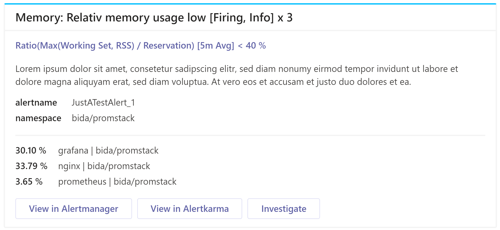

# Customize your cards

While *prometheus-msteams* comes with a default card template out of the box,
  you can easily provide a custom template file to adapt your notification cards
  to your exact requirements. If you have a template file you would like to
  contribute to this collection of examples don't hesitate to open a pull request
  or issue.

## Table of Contents

- [Silence Alerts from MS Teams](#silence-alerts-from-ms-teams)
- [Grafana Alert like Card Template](#grafana-alert-like-card-template)

## Silence Alerts from MS Teams

A [silence action card template](./templates/card-with-silence-action.tmpl) has been created for those who need acknowledge the alerts from MS Teams. The template works together with [Alertmanger](https://prometheus.io/docs/alerting/alertmanager/)


This template provides an action which opens the **Alertmanager UI** with all the information about your alert and the Silence is created via Alertmanager.


## Grafana Alert like Card Template

This [template](./templates/card-grafana-inspired.tmpl) shows keys and values
  in a list similar to how Grafana formats alerts for Teams.



When you use the MS Teams integration for your Grafana Alert, the notifications
  are grouped by alert while also listing the legend and value of every time
  series that matched the respective alert expressions. This template tries
  to recreate and improve this behavior and card layout.

It comes with a number of requirements alert rules must fullfill. Therefore the
  template also contains a fallback template that is more or less the same as
  the default provided with prometheus-msteams. To trigger the grafana layout
  the annotation `template` must be set to "group". Your Alertmanager must
  also be configured to group at least by alert name.

A detailed info on all requirements including examples can be found as a
  comment in the template file itself.

```yml
- alert: Memory_Ratio_WorkingSetAndRss_Reservation_High
  expr: |
    max by (namespace, name) (
      (
        avg_over_time(container_memory_working_set_bytes[1h])
        > avg_over_time(container_memory_rcontainer_memory_rss[1h])
        or avg_over_time(container_memory_rcontainer_memory_rss[1h])
      )
      / on (namespace, name, id) avg_over_time(container_spec_memory_reservation_limit_bytes[1h]) != +Inf
    ) * 100 > 150
  for: 12h
  labels:
    severity: "info"
    alert_with_resolve: "true"
  annotations:
    title: "Memory: Relativ memory usage above reservation"
    summary: "Ratio(Max(Working Set, RSS) / Reservation) [1h Avg for 12h] > 150 %"
    description: >
      The ratio of the working set memory or resident set size against the
      configured reservation has been above 150 % percent as a 1h average
      for more than 12h.
    key: "{{ $labels.name }} | {{ $labels.namespace }}"
    value: '{{ $value | printf "%.2f" }} %'
    investigate_link: 'https://${DOMAIN}/promstack/grafana/d/fdwTIxFMz/container-intra'
    template: "group"
```
