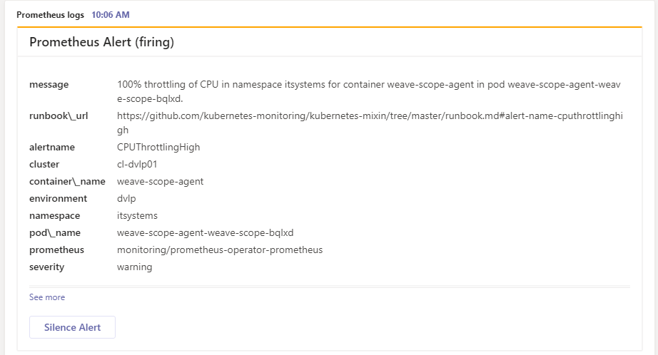
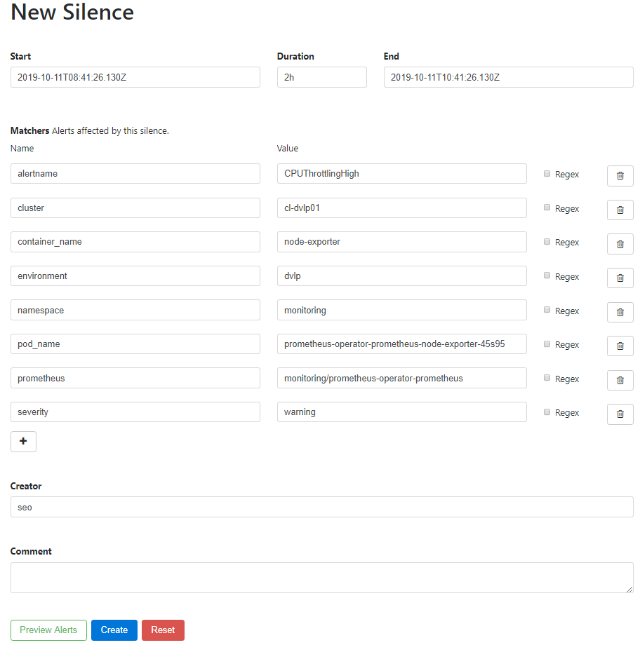

# Customize your cards

## Silence Alerts from MS Teams

A [silence action card template](./templates/card-with-silence-action.tmpl) has been created for those who need acknowledge the alerts from MS Teams. The template works together with [Alertmanger](https://prometheus.io/docs/alerting/alertmanager/)

This template provides an action which opens the **Alertmanager UI** with all the information about your alert and the Silence is created via Alertmanager.

